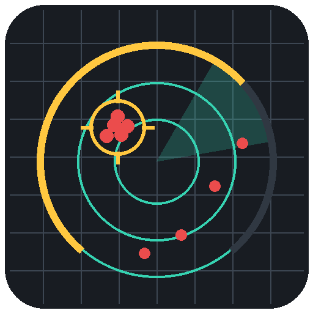
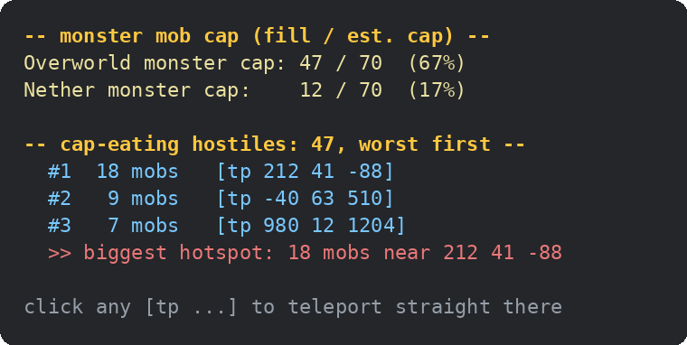

<div align="center">



# mobcensus

### How full is your hostile mob cap right now — and where is the load sitting?

A pure-vanilla Minecraft **datapack** (MC 26.2) that answers the one question
vanilla never answers cleanly: it estimates the **monster mob-cap fill per
dimension**, and pinpoints the **hotspots** of cap-eating mobs so you can click
to teleport straight to them.

[](https://github.com/mhuot/mobcensus/actions/workflows/ci.yml)
[](https://github.com/mhuot/mobcensus/actions/workflows/functional.yml)
[](https://github.com/mhuot/mobcensus/releases)
[](LICENSE)
[](https://www.minecraft.net)



*Example output — every `[tp ...]` is click-to-teleport. (A live gameplay gif is the one thing not auto-generated; drop one in at `docs/demo.gif`.)*

</div>

---

## Two lanes (don't confuse them)

mobcensus deliberately separates two things vanilla blurs together:

| Lane | Set | What it means | Used by |
| --- | --- | --- | --- |
| **Cap-accurate** | `#mobcensus:cap_mobs` | Monster-category natural spawners that actually count toward the hostile cap. Filtered at runtime to **non-persistent** mobs **within spawn range of a player**. | `cap`, `hotspots` |
| **General finder** | `#mobcensus:hostiles` | *Everything* hostile — `cap_mobs` **plus** shulkers and the warden. For "just find me any hostile." | `here`, `loaded`, `counts` |

The cap promise only ever points at the cap-accurate lane.

## Commands

| Command | Lane | What it does | Best from |
| --- | --- | --- | --- |
| `/function mobcensus:cap` | cap | Monster-cap **fill / estimated cap and percent, per dimension** | In-game / RCON |
| `/function mobcensus:hotspots` | cap | Cap-eaters grouped into hotspots, **worst first**, click-to-teleport | In-game / RCON |
| `/function mobcensus:here` | finder | Hostiles within your radius, click-to-teleport | In-game |
| `/function mobcensus:loaded` | finder | Every loaded hostile, **all dimensions**, click-to-teleport | In-game |
| `/function mobcensus:counts` | finder | Per-type counts into storage | RCON |
| `/function mobcensus:config` | — | Show the tunables | In-game |
| `/function mobcensus:help` | — | Command list | In-game |

## How the cap number is estimated (and where it's approximate)

Vanilla's monster cap is:

```
monster_cap = 70 × eligible_chunks ÷ 289
```

`289` is the 17×17 chunk area around each player, and the game counts the
**union of unique chunks** across all players (so the cap grows as players
spread out). **A pure datapack cannot read the eligible-chunk count.** So
mobcensus approximates:

```
estimated_cap = 70 × (number of separated player groups in the dimension)
```

Each isolated player group is treated as one full 289-chunk (cap-70) area. The
fill is the count of non-persistent `#mobcensus:cap_mobs` within the configured
radius of a player. The math lives in comments in `cap.mcfunction` /
`_cap_calc.mcfunction` so it's auditable.

**Honest gaps** (see [the report below](#known-approximations)):
- Exact for a single player group; an approximation when players spread out (it
  ignores *partial* chunk overlap between groups).
- Assumes simulation distance ≥ 8 (the spawn-range cap). Lower settings shrink
  the real per-player area.
- Counts monster-category natural spawners; it does not model per-mob sub-rules
  (slime chunks, phantom-from-sleep) or the despawn sphere precisely.

## Configuration (no function editing)

Tunables live in storage `mobcensus:config` with sane defaults:

| Key | Default | Meaning |
| --- | --- | --- |
| `radius` | `128` | Spawn range scanned around each player |
| `cluster` | `16` | Hotspot grouping radius |
| `region` | `256` | Distance under which players share one cap "group" |

Change them with plain commands (they survive reloads):

```mcfunction
/data modify storage mobcensus:config radius set value 96
/function mobcensus:config        # show current values
```

## RCON usage

`tellraw` output isn't returned over RCON — command feedback and `data get`
are. Everything is mirrored to storage:

```bash
rcon-cli "function mobcensus:cap"
rcon-cli "data get storage mobcensus:find cap"
# → {overworld:{fill:47,cap:70,percent:67,players:1,regions:1}, nether:{...}, end:{...}}

rcon-cli "function mobcensus:hotspots"
rcon-cli "data get storage mobcensus:find clusters"   # [{cluster:1,count:18,pos:[...]}, ...]

rcon-cli "function mobcensus:counts"
rcon-cli "data get storage mobcensus:find counts"     # {zombie:4, creeper:2, total:6, ...}
```

## Performance

No per-tick work — nothing runs unless you call it. Costs:

| Function | Cost |
| --- | --- |
| `cap` | 3 dimension passes; each = one player scan + a player-group recursion + one mob scan |
| `hotspots` | one scan to build the set, then one scan per emitted cluster (not per mob) |
| `here` | one scan + one line per hostile in range |
| `loaded` | one line per loaded hostile across three dimensions |
| `counts` | a handful of `if entity` scans |

Clustering is greedy and bounded by cluster count, so it stays cheap even with
hundreds of mobs. With no players online, the cap is correctly `0`.

## Install

1. Copy the `mobcensus` folder into your world: `<world>/datapacks/mobcensus/`
2. `/reload` (or restart). Confirm with `/datapack list` → `file/mobcensus`.

Requirements: **Minecraft 26.2** (datapack format `101`–`107`). Works on any
world or server — vanilla, Fabric, Paper.

## Development

```bash
python scripts/validate_pack.py                  # metadata + JSON
python scripts/build.py --output dist/mobcensus.zip
python tests/functional_test.py mc-mayhem        # behavioural tests vs a live server
```

CI runs **validate → lint (black, pylint) → build**, plus a **functional**
workflow that boots a real 26.2 server, asserts every function loads (no parse
regressions), and checks clustering, counts, tag lanes, and the cap math.
Tagging `vX.Y.Z` builds and publishes a release zip.

## License

[MIT](LICENSE) © Mike Huot
